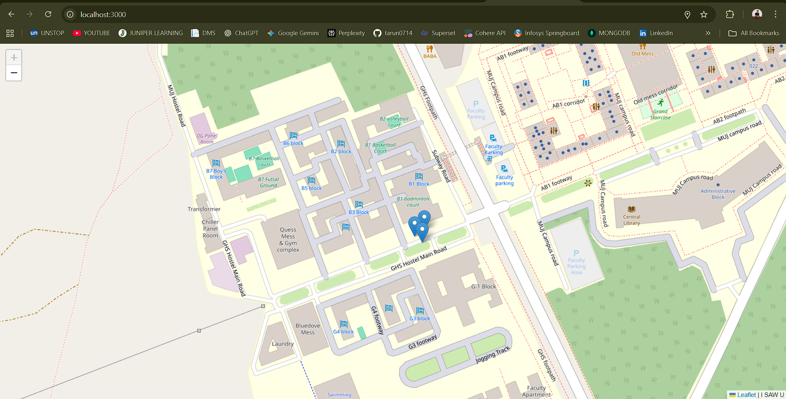

# 📍 Real Time Tracker

A real-time location tracking application built with **Express.js** and **Socket.io**, deployed on **Vercel**.  
This project allows users to share and track live locations on an interactive map.

---

## 🚀 Features
- 🌍 Real-time location tracking using **Socket.io**
- 📡 Live updates broadcasted to all connected clients
- ⚡ Deployed easily on **Vercel**
- 🎨 Frontend served with static assets

---

## 🖼️ Screenshot



---

## 📦 Installation & Setup

1. Clone the repository:
   ```bash
   git clone https://github.com/your-username/real-time-tracker.git
   cd real-time-tracker
   ```

2. Install dependencies:
   ```bash
   npm install
   ```

3. Run locally:
   ```bash
   npm run dev
   ```
   Visit [http://localhost:3000](http://localhost:3000).

---

## 🌐 Deployment on Vercel

1. Install Vercel CLI:
   ```bash
   npm i -g vercel
   ```

2. Deploy:
   ```bash
   vercel
   ```

3. Update frontend to connect to your deployed backend:
   ```js
   const socket = io("https://your-vercel-project.vercel.app");
   ```

---

## 🛠️ Tech Stack
- **Node.js**
- **Express.js**
- **Socket.io**
- **Vercel (Deployment)**

---

## 👨‍💻 Author
- [Tarun Gupta](https://github.com/tarun0714)
